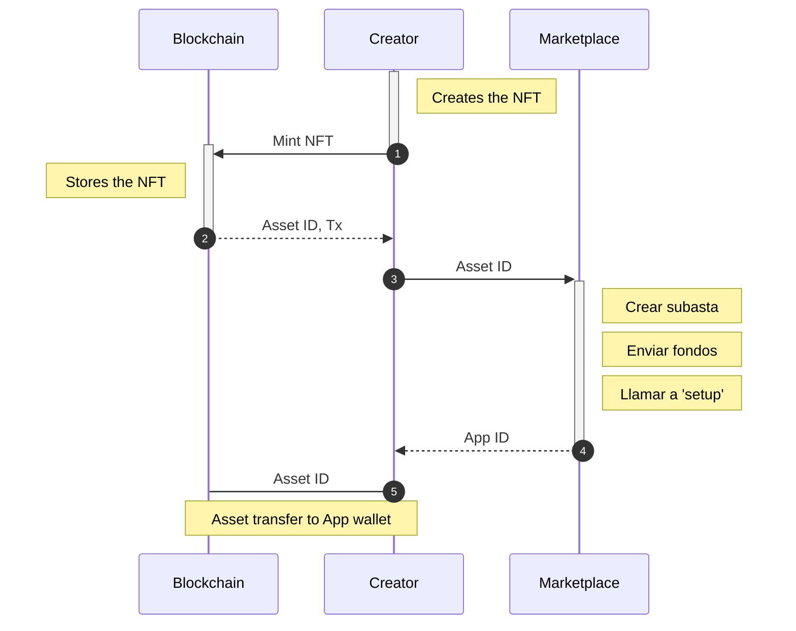

# Common code

## Setup

Remember to init the submodules and pull often!

```sh
# Run this in your dependent projects
git submodule update
```

## Logic

Normal auction interaction logic (Frontend, backend & blockchain)



## Dependencies

- `algosdk`
- `typedi`
- `reflect-metadata`
